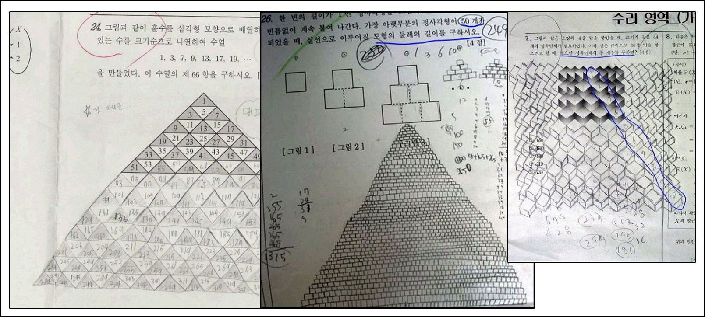
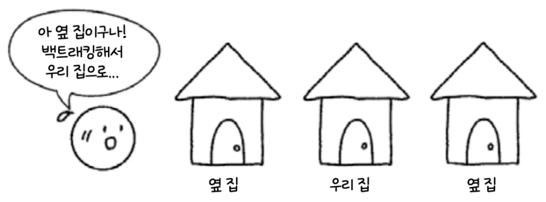

# 💪 Brute Force



> **Brute** (무식한) + **Force** (힘)
>
> 무식하게 **모든 가능한 경우의 수를 탐색**하여 최적의 결과를 찾는 방법
>
> 모든 경우를 탐색하기에 **100%의 정확성을 보장**하지만,
>
> 모든 경우를 탐색하기에 **높은 시간 복잡도**를 가짐

# 🔙 Backtraking



> **가능성이 있는 곳**을 탐색
>
> **가능성이 없는 곳**은 되돌아감 (되돌아갈 때는 이전 상태로 되돌아 감에 주목!)
>
> 문제마다 효율이 달라져서 시간 복잡도를 특정하여 정의하기 어려움
>
> **가능성이 없는 탐색 대상을 배제**할 수 있으므로 탐색 효율이 **완전 탐색하는 방법보다 훨씬 효율적**
>
> **Pruning(가지치기)** : 더 이상 탐색할 필요가 없는 상태를 제외하는 것

# 🧐 완전 탐색 활용

## 1️⃣ **단순 Brute-Force**

**단순히 반복문과 조건문을 활용해 모든 경우의 수를 찾는 방법**

(예시) 주어진 리스트에서 두 숫자의 합이 특정 값이 되는 모든 조합을 찾기

```python
def brute_force_sum(arr, target):
    n = len(arr)
    for i in range(n):
        for j in range(i + 1, n):
            if arr[i] + arr[j] == target:
                print(f"Pair: ({arr[i]}, {arr[j]})")

brute_force_sum([1, 2, 3, 4, 5], 5)
```

📌 시간 복잡도: O(N^2) → 입력 크기가 커질수록 비효율적

## 2️⃣ **재귀함수**

**함수 안에 자신의 함수를 다시 호출하는 함수 (**재귀 탈출 조건**, **로직**, **함수 호출**로 구성됨)**

다른 파라미터에 대해 같은 행위를 하는 함수

(예시) 순열 구하는 재귀 함수

```python
def brute_force_permutation(arr, chosen):
    if len(chosen) == len(arr):  # 모든 요소를 선택한 경우
        print(chosen)
        return

    for num in arr:  # 모든 숫자를 반복
        if num not in chosen:  # 이미 선택한 숫자는 제외
            brute_force_permutation(arr, chosen + [num])

brute_force_permutation([1, 2, 3], [])
```

## 3️⃣ **순열**

**임의의 수열이 있을 때, 다른 순서로 연산하는 방법**

예를 들어, `[1, 2, 3]` 으로 만들 수 있는 **모든 순열(Permutation)** 을 생성

### 🔹 **순열을 브루트포스로 구하는 방법**

```python
def brute_force_permutation(arr, chosen):
    if len(chosen) == len(arr):
        print(chosen)  # 하나의 순열 완성
        return

    for num in arr:
        if num not in chosen:  # 중복 방지
            brute_force_permutation(arr, chosen + [num])

brute_force_permutation([1, 2, 3], [])
```

📌 시간 복잡도: O(N!) → 가능한 모든 경우를 시도하기 때문에 비효율적입니다.

### 🔹 **백트래킹: 불필요한 탐색 줄이기**

조합(Combination) 을 찾을 때, 이미 정한 값보다 작은 숫자는 제외하는 식으로 최적화

```python
def backtracking_combination(arr, chosen, start, r):
  if len(chosen) == r:
      print(chosen)  # r개 선택 완료
      return

  for i in range(start, len(arr)):  # 중복 선택 방지
      backtracking_combination(arr, chosen + [arr[i]], i + 1, r)

backtracking_combination([1, 2, 3, 4], [], 0, 2)  # 2개 조합
```

📌 시간 복잡도: O(2^N) (브루트포스보다는 낫지만, 문제에 따라 여전히 많을 수 있음)

## 4️⃣ **비트마스크**

**2진수 표현 기법을 활용하는 방법 (각각의 원소가 포함되거나, 포함되지 않는 두 가지 선택으로 구성되는 경우에 유용)**

배열 순회를 거치지 않고, bit를 통해 **O(1)**으로 원하는 정보를 얻을 수 있음

| 언어   | 기본 int 비트 수                 | 표현 가능한 정보 개수                  |
| ------ | -------------------------------- | -------------------------------------- |
| Python | 무제한 (BigInt)                  | 사실상 제한 없음                       |
| Java   | 32비트 (int), 64비트 (long)      | int → 최대 32개, long → 최대 64개      |
| C++    | 32비트 (int), 64비트 (long long) | int → 최대 32개, long long → 최대 64개 |

```python
# 특정 인덱스 방문 처리 (예: 3번 인덱스 방문)
visited |= (1 << 3)

# 특정 인덱스 방문 여부 확인
if visited & (1 << 3):
    print("3번 인덱스 방문함")

# 특정 인덱스 방문 해제 (예: 3번 인덱스 방문 취소)
visited &= ~(1 << 3)
```

## 5️⃣ **너비 우선 탐색(BFS), 깊이 우선 탐색(DFS)**

**그래프에서 모든 정점을 탐색하기 위한 방법**

- 너비 우선 탐색 (Breadth-First Search)는 하나의 요소를 방문하고 그 요소에 인접한 모든 요소를 우선 방문
- 깊이 우선 탐색 (Depth-First Seach)는 시작 노드에서 자식 노드를 순서대로 탐색하면서 깊이를 우선으로 방문
